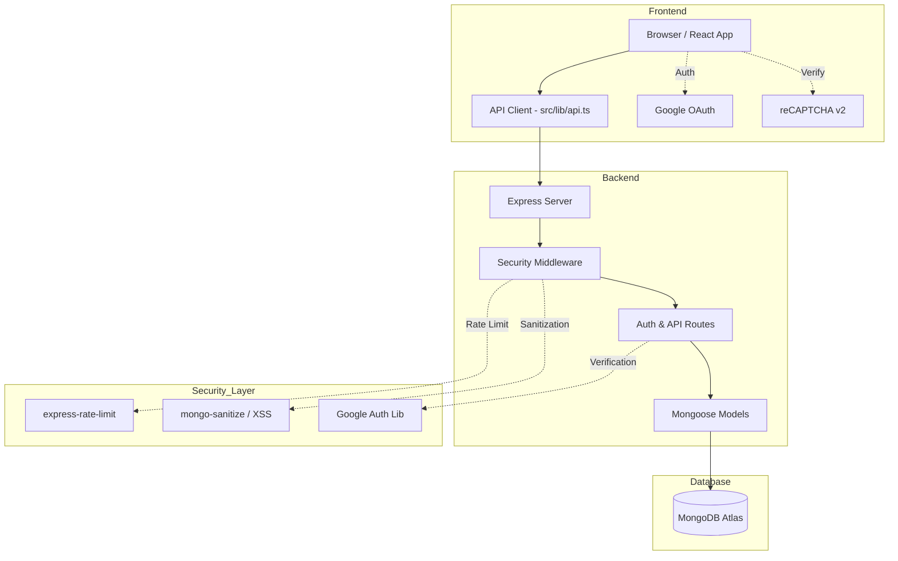

# Modern Portfolio: Secure & Dynamic

This project is a high-performance, modern portfolio built with a **Vite/React** frontend and a custom **Node.js/Express** backend integrated with **MongoDB Atlas**, featuring advanced security and dynamic content management.

## 🚀 Key Features
- **Dynamic Identity**: Manage your full name, hero title, bio, and social links directly from the Admin Dashboard.
- **Google OAuth 2.0**: Secure, one-click login for administrators.
- **reCAPTCHA v2**: Bot protection on all authentication forms.
- **Platform Hardening**: Integrated security middleware including Helmet, Rate Limiting, and XSS Sanitization.

## 🛠 Tech Stack
- **Frontend**: Vite, React, Tailwind CSS, Framer Motion, Lucide React.
- **Backend**: Node.js, Express, Mongoose (MongoDB).
- **Security**: Google OAuth, reCAPTCHA v2, JWT, Helmet.

## 📊 Architecture Diagram


## ⚙️ Setup & Installation

### 1. Prerequisites
- Node.js (v18+)
- MongoDB Atlas account
- Google Cloud Console Project (for OAuth)
- Google reCAPTCHA v2 API Keys

### 2. Backend Setup (`/server/.env`)
```env
MONGODB_URI=your_mongodb_atlas_connection_string
JWT_SECRET=your_jwt_secret_key
PORT=5000
GOOGLE_CLIENT_ID=your_google_client_id
RECAPTCHA_SECRET_KEY=your_recaptcha_secret_key
FRONTEND_URL=http://localhost:5173
```

### 3. Frontend Setup (`/.env`)
```env
VITE_GOOGLE_CLIENT_ID=your_google_client_id
VITE_RECAPTCHA_SITE_KEY=your_recaptcha_site_key
```

## 🏃 Running the Project

### Start the Backend
```bash
cd server
npm start
```

### Start the Frontend
```bash
npm run dev
```

## 🔐 Admin Authentication
To manage your portfolio content, log in via the `/login` route. You can use traditional credentials or the **Sign in with Google** option for a faster, more secure experience.

---
> [!IMPORTANT]
> Ensure all environment variables are correctly configured in both the root and `/server` directories before starting the application. Never commit `.env` files to version control.
