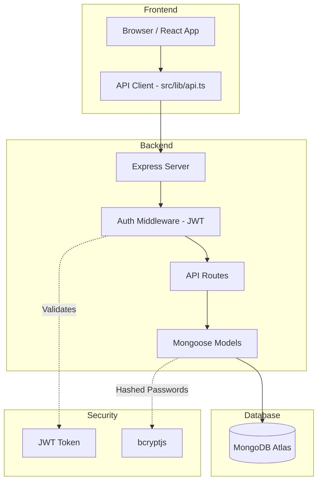

# Modern Portfolio Migration: Supabase to MongoDB Atlas

This project is a high-performance, modern portfolio built with a **Vite/React** frontend and a custom **Node.js/Express** backend integrated with **MongoDB Atlas**.

## 🚀 Recent Migration Notice
The project has been migrated from Supabase to a custom backend for better control, scalability, and simplified data management.

## 🛠 Tech Stack
- **Frontend**: Vite, React, Tailwind CSS, Framer Motion, Lucide React.
- **Backend**: Node.js, Express, Mongoose (MongoDB).
- **Auth**: JWT (JSON Web Tokens) with secure password hashing via `bcryptjs`.

## 📊 Architecture Diagram


## 📂 Project Structure
- `/` - Root directory containing the Vite/React frontend.
- `/server` - Backend directory with Express API, Mongoose models, and authentication logic.
- `/src` - Frontend source code (pages, components, lib).
- `/src/lib/api.ts` - Centralized API client replacing the old Supabase client.

## ⚙️ Setup & Installation

### 1. Prerequisites
- Node.js (v18+)
- MongoDB Atlas account (or local MongoDB instance)

### 2. Backend Setup
1. Navigate to the `server` directory:
   ```bash
   cd server
   ```
2. Install dependencies:
   ```bash
   npm install
   ```
3. Create a `.env` file in `/server` and add:
   ```env
   MONGODB_URI=your_mongodb_atlas_connection_string
   JWT_SECRET=your_jwt_secret_key
   PORT=5000
   ```

### 3. Frontend Setup
1. In the root directory, install dependencies:
   ```bash
   npm install
   ```

## 🏃 Running the Project

### Start the Backend
```bash
cd server
npm start
```
The server will run on `http://localhost:5000`.

### Start the Frontend
```bash
npm run dev
```
The frontend will be available at `http://localhost:5173`.

## 🔐 Admin Authentication
To manage your blog posts, projects, and profile, log in to the `/login` route with your admin credentials.

- **Email**: Enter your admin email (used during seeding).
- **Password**: Enter your admin password (used during seeding).

---
> [!IMPORTANT]
> The default credentials were used during the initial seeding process. Please update your password immediately after your first login for security and Ensure your `.env` file is never committed to version control.
